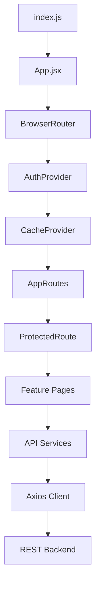
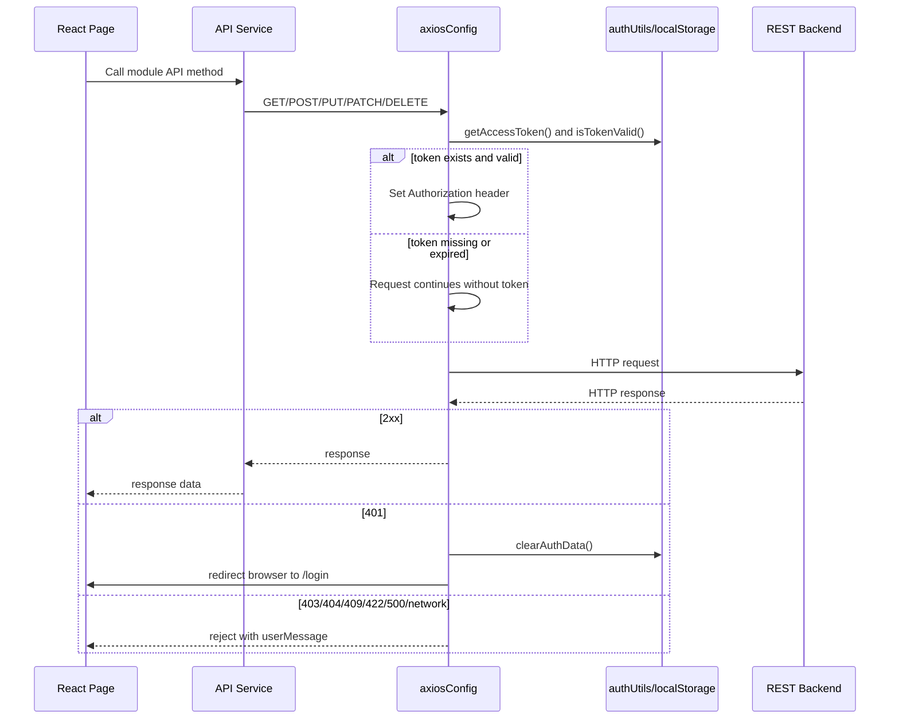
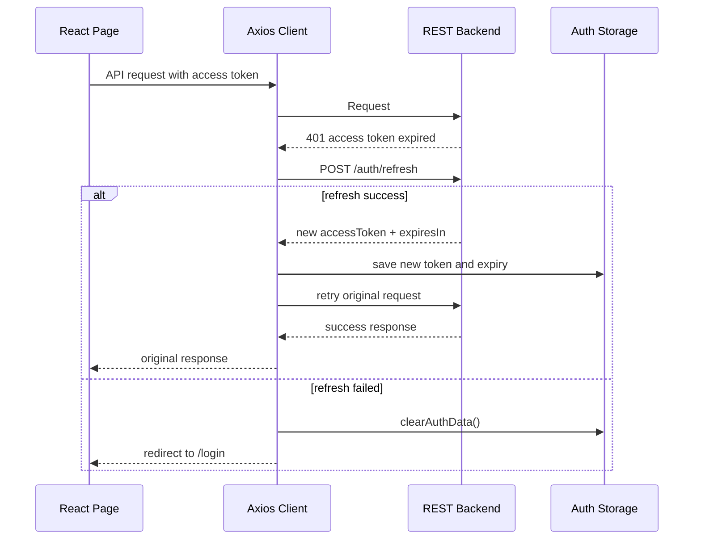
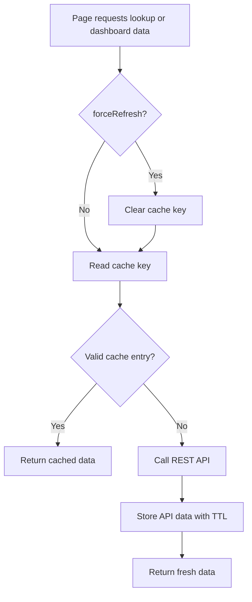
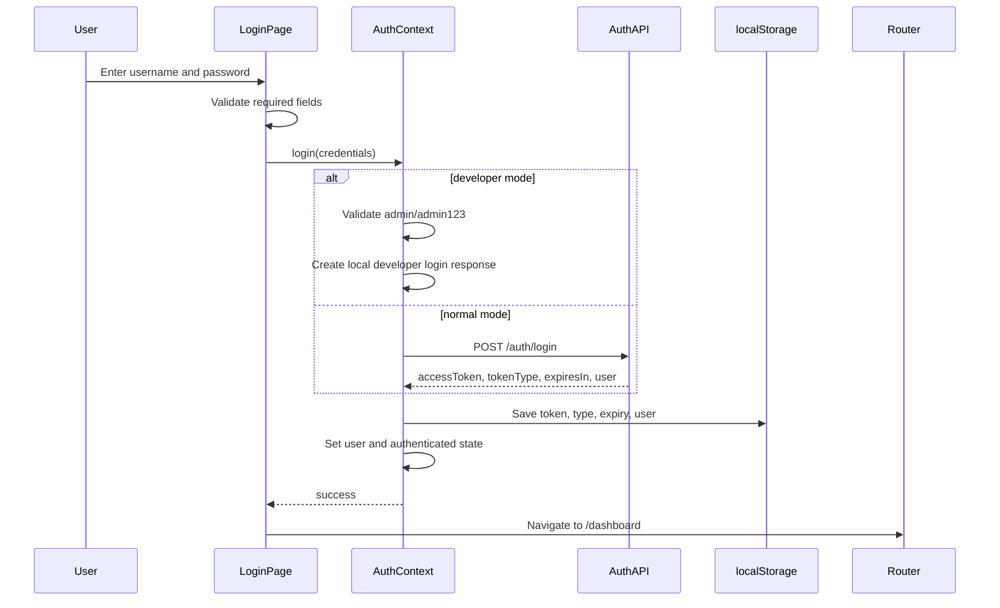
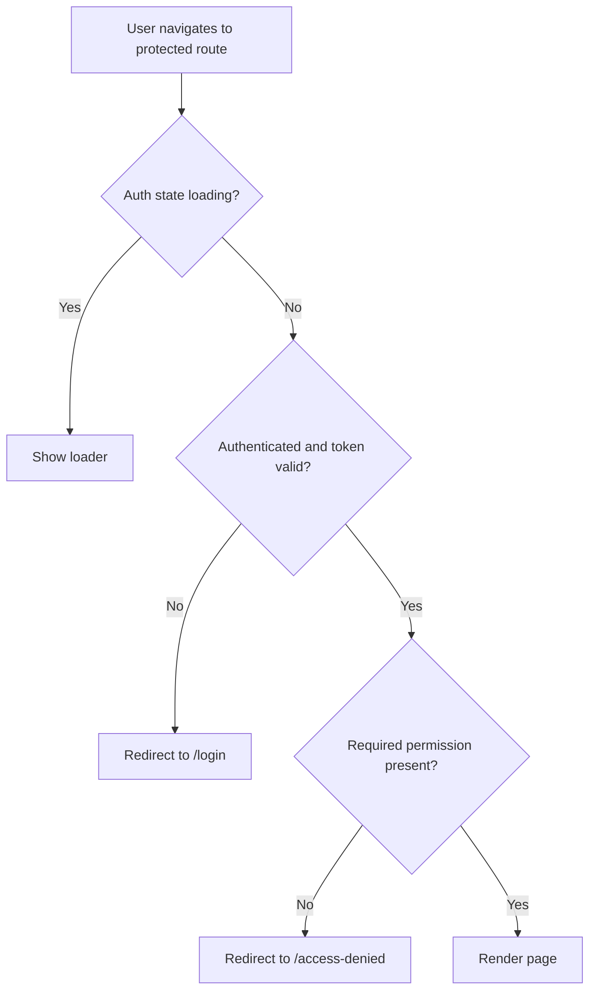
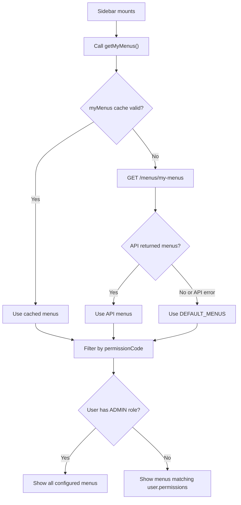
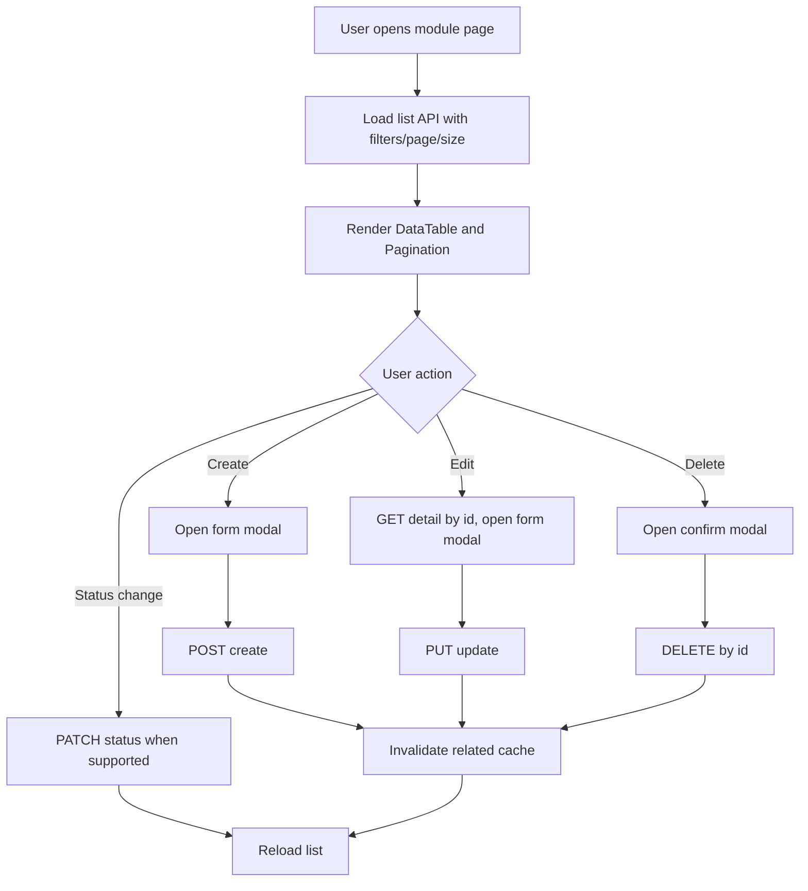

# Role Based Security Frontend - Project Documentation

## 1. Project Overview

The Role Based Security Frontend is a React 18 single page application for managing a role based security system. It provides UI modules for authentication, dashboard summaries, users, roles, permissions, menu access, audit logs, and settings.

The project is frontend-only. It expects a REST backend, currently documented as a Java Spring Boot API, to expose endpoints under a configurable base URL.

Primary responsibilities:

- Authenticate users with JWT based login.
- Store the access token, token type, expiry, and logged-in user in browser `localStorage`.
- Attach `Authorization: Bearer <token>` to backend API requests.
- Protect routes with permission checks.
- Hide or disable UI actions with permission guards.
- Cache lookup data and dashboard data in memory to reduce repeated API calls.
- Render menus dynamically from `/menus/my-menus`, with a static fallback.

## 2. Technology Stack

| Area | Technology |
|---|---|
| UI framework | React 18 |
| Routing | React Router DOM 6 |
| API client | Axios |
| Styling | Bootstrap 5, Bootstrap Icons, custom CSS |
| State | React Context API |
| Auth storage | Browser localStorage |
| Cache storage | In-memory JavaScript Map |
| Build tooling | Create React App / react-scripts |

## 3. Setup and Run

### Prerequisites

- Node.js 16 or later.
- npm.
- Backend REST API running and reachable by the frontend.

### Install dependencies

```bash
npm install
```

### Configure environment

Create `.env` from `.env.example` and update the backend URL:

```env
REACT_APP_API_BASE_URL=http://localhost:8080/api
REACT_APP_DEVELOPER_MODE=false
```

Environment variables:

| Variable | Purpose | Default or expected value |
|---|---|---|
| `REACT_APP_API_BASE_URL` | Base URL used by the shared Axios client. | `http://localhost:8080/api` |
| `REACT_APP_DEVELOPER_MODE` | Enables local developer login bypass. | `false` |

### Start development server

```bash
npm start
```

The app runs at:

```text
http://localhost:3000
```

### Build production bundle

```bash
npm run build
```

The production output is generated in `build/`.

## 4. Project Structure

```text
src/
|-- api/                    REST API service wrappers
|   |-- axiosConfig.js      Central Axios instance, auth headers, errors
|   |-- authApi.js
|   |-- dashboardApi.js
|   |-- userApi.js
|   |-- roleApi.js
|   |-- permissionApi.js
|   |-- menuApi.js
|   `-- auditLogApi.js
|-- components/
|   |-- common/             Shared UI components
|   |-- forms/              Reusable form inputs
|   |-- layout/             App shell, header, sidebar
|   `-- security/           ProtectedRoute and PermissionGuard
|-- context/
|   |-- AuthContext.jsx     Login/logout/user/permission state
|   `-- CacheContext.jsx    Cache helpers for lookup and dashboard data
|-- pages/                  Feature pages
|-- routes/AppRoutes.jsx    Route definitions and permission mapping
|-- styles/                 Global, layout, table, and form CSS
|-- utils/                  Auth, cache, permissions, constants, validators
|-- App.jsx                 Provider and router composition
`-- index.js                React entry point
```

## 5. Application Architecture

The root component wraps all routes with browser routing, authentication state, and cache state.



Main files:

| File | Responsibility |
|---|---|
| `src/App.jsx` | Composes `BrowserRouter`, `AuthProvider`, `CacheProvider`, and routes. |
| `src/routes/AppRoutes.jsx` | Defines public and protected routes. |
| `src/context/AuthContext.jsx` | Manages login, logout, user state, authentication state, and permission helpers. |
| `src/context/CacheContext.jsx` | Provides cached fetch helpers and cache invalidation methods. |
| `src/api/axiosConfig.js` | Centralizes API base URL, timeout, JWT header injection, and global error handling. |
| `src/components/security/ProtectedRoute.jsx` | Redirects unauthenticated users to login and unauthorized users to access denied. |
| `src/components/security/PermissionGuard.jsx` | Shows, hides, or disables UI elements based on permission checks. |

## 6. Application Modules

### 6.1 Authentication Module

Files:

- `src/pages/LoginPage.jsx`
- `src/context/AuthContext.jsx`
- `src/api/authApi.js`
- `src/utils/authUtils.js`

Responsibilities:

- Validate login form input.
- Call `POST /auth/login`.
- Persist JWT data and user details in `localStorage`.
- Restore authentication state after page refresh.
- Logout by calling `POST /auth/logout`, then clearing auth and cache data.
- Support developer mode login when `REACT_APP_DEVELOPER_MODE=true`.

Developer mode credentials:

| Username | Password |
|---|---|
| `admin` | `admin123` |

Developer mode creates a local token and grants all permissions from `PERMISSIONS`.

### 6.2 Dashboard Module

Files:

- `src/pages/DashboardPage.jsx`
- `src/api/dashboardApi.js`
- `src/context/CacheContext.jsx`

Responsibilities:

- Show summary cards such as total users, active users, roles, permissions, recent logins, and pending actions.
- Show recent updates.
- Show quick actions based on create/view permissions.
- Cache dashboard summary for 2 minutes.

Backend endpoint:

- `GET /dashboard/summary`

### 6.3 User Management Module

Files:

- `src/pages/users/UsersPage.jsx`
- `src/pages/users/UserForm.jsx`
- `src/pages/users/UserDetails.jsx`
- `src/api/userApi.js`

Responsibilities:

- List users with pagination and filters.
- View user details.
- Create users.
- Update users.
- Delete users.
- Activate or deactivate users.
- Assign roles to users.
- Load role options from the cache layer.

Main permissions:

- `USER_VIEW`
- `USER_CREATE`
- `USER_UPDATE`
- `USER_DELETE`

### 6.4 Role Management Module

Files:

- `src/pages/roles/RolesPage.jsx`
- `src/pages/roles/RoleForm.jsx`
- `src/api/roleApi.js`

Responsibilities:

- List roles with pagination and filters.
- Create roles.
- Update roles.
- Delete roles.
- Load assigned role permissions.
- Assign permissions to roles.
- Prevent deletion of protected system role behavior at UI level through constants such as `SYSTEM_ROLE_ADMIN`.

Main permissions:

- `ROLE_VIEW`
- `ROLE_CREATE`
- `ROLE_UPDATE`
- `ROLE_DELETE`

### 6.5 Permission Management Module

Files:

- `src/pages/permissions/PermissionsPage.jsx`
- `src/pages/permissions/PermissionForm.jsx`
- `src/api/permissionApi.js`

Responsibilities:

- List permissions with pagination and filters.
- Create permissions.
- Update permissions.
- Delete permissions.
- Filter by search text, module name, and status.

Main permissions:

- `PERMISSION_VIEW`
- `PERMISSION_CREATE`
- `PERMISSION_UPDATE`
- `PERMISSION_DELETE`

### 6.6 Menu Access Management Module

Files:

- `src/pages/menus/MenusPage.jsx`
- `src/pages/menus/MenuForm.jsx`
- `src/components/layout/Sidebar.jsx`
- `src/api/menuApi.js`

Responsibilities:

- Manage application menu records.
- Load all menus for administration.
- Load logged-in user's menus for sidebar rendering.
- Fall back to static default menus if `/menus/my-menus` fails or returns no data.
- Filter menu visibility by `permissionCode`.

Main permissions:

- `MENU_VIEW`
- `MENU_CREATE`
- `MENU_UPDATE`
- `MENU_DELETE`

### 6.7 Audit Logs Module

Files:

- `src/pages/auditLogs/AuditLogsPage.jsx`
- `src/api/auditLogApi.js`

Responsibilities:

- List audit events.
- Filter by username, action, module name, start date, and end date.
- Paginate audit log results.

Main permission:

- `AUDIT_VIEW`

### 6.8 Settings Module

Files:

- `src/pages/SettingsPage.jsx`

Responsibilities:

- Placeholder page for future backend configuration.
- Shows logged-in user details and API base URL.

Main permission:

- `SETTINGS_VIEW`

## 7. Route and Permission Matrix

| Route | Page | Required permission |
|---|---|---|
| `/login` | Login | Public |
| `/dashboard` | Dashboard | `DASHBOARD_VIEW` |
| `/users` | User Management | `USER_VIEW` |
| `/roles` | Role Management | `ROLE_VIEW` |
| `/permissions` | Permission Management | `PERMISSION_VIEW` |
| `/menus` | Menu Access Management | `MENU_VIEW` |
| `/audit-logs` | Audit Logs | `AUDIT_VIEW` |
| `/settings` | Settings | `SETTINGS_VIEW` |
| `/access-denied` | Access Denied | Public route, used after failed permission check |
| `/` | Redirect | Redirects to `/dashboard` |
| `*` | Not Found | Public 404 route |

Permission rules:

- If a route has no permission, access is allowed.
- If the user has role `ADMIN`, permission checks pass.
- Otherwise, the permission code must exist in `user.permissions`.
- Route-level checks are handled by `ProtectedRoute`.
- UI-level checks are handled by `PermissionGuard`.

## 8. REST API Endpoints

All endpoints are relative to:

```text
REACT_APP_API_BASE_URL
```

Default:

```text
http://localhost:8080/api
```

### 8.1 Authentication APIs

| Method | Endpoint | Purpose | Body or params |
|---|---|---|---|
| `POST` | `/auth/login` | Authenticate user and return token plus user data. | `{ username, password }` |
| `POST` | `/auth/logout` | Logout current user on backend. | None |
| `GET` | `/auth/profile` | Fetch current user profile. | None |

Expected login response:

```json
{
  "accessToken": "jwt-token",
  "tokenType": "Bearer",
  "expiresIn": 3600,
  "user": {
    "id": 1,
    "username": "admin",
    "email": "admin@example.com",
    "roles": ["ADMIN"],
    "permissions": ["USER_VIEW", "ROLE_VIEW"]
  }
}
```

### 8.2 Dashboard APIs

| Method | Endpoint | Purpose |
|---|---|---|
| `GET` | `/dashboard/summary` | Dashboard counts, recent updates, login counts, and pending security actions. |

Expected fields used by UI:

```json
{
  "totalUsers": 120,
  "activeUsers": 98,
  "totalRoles": 8,
  "totalPermissions": 45,
  "recentLoginCount": 17,
  "pendingSecurityActions": 2,
  "recentUpdates": []
}
```

### 8.3 User APIs

| Method | Endpoint | Purpose | Body or params |
|---|---|---|---|
| `GET` | `/users` | List users. | Query: `page`, `size`, `search`, `username`, `email`, `role`, `status` |
| `GET` | `/users/{id}` | Get user details. | Path: `id` |
| `POST` | `/users` | Create user. | User form payload |
| `PUT` | `/users/{id}` | Update user. | User form payload |
| `DELETE` | `/users/{id}` | Delete user. | Path: `id` |
| `PATCH` | `/users/{id}/status` | Activate or deactivate user. | `{ status }` |
| `POST` | `/users/{id}/roles` | Assign roles to user. | `{ roleIds }` |

### 8.4 Role APIs

| Method | Endpoint | Purpose | Body or params |
|---|---|---|---|
| `GET` | `/roles` | List roles. | Query: `page`, `size`, `search`, `status` |
| `GET` | `/roles/{id}` | Get role details. | Path: `id` |
| `POST` | `/roles` | Create role. | Role form payload |
| `PUT` | `/roles/{id}` | Update role. | Role form payload |
| `DELETE` | `/roles/{id}` | Delete role. | Path: `id` |
| `GET` | `/roles/{id}/permissions` | Get permissions assigned to role. | Path: `id` |
| `POST` | `/roles/{id}/permissions` | Assign permissions to role. | `{ permissionIds }` |

### 8.5 Permission APIs

| Method | Endpoint | Purpose | Body or params |
|---|---|---|---|
| `GET` | `/permissions` | List permissions. | Query: `page`, `size`, `search`, `moduleName`, `status` |
| `GET` | `/permissions/{id}` | Get permission details. | Path: `id` |
| `POST` | `/permissions` | Create permission. | Permission form payload |
| `PUT` | `/permissions/{id}` | Update permission. | Permission form payload |
| `DELETE` | `/permissions/{id}` | Delete permission. | Path: `id` |

### 8.6 Menu APIs

| Method | Endpoint | Purpose | Body or params |
|---|---|---|---|
| `GET` | `/menus` | List all menu records. | None |
| `GET` | `/menus/my-menus` | List menus available to the logged-in user. | None |
| `GET` | `/menus/{id}` | Get menu details. | Path: `id` |
| `POST` | `/menus` | Create menu. | Menu form payload |
| `PUT` | `/menus/{id}` | Update menu. | Menu form payload |
| `DELETE` | `/menus/{id}` | Delete menu. | Path: `id` |

### 8.7 Audit Log APIs

| Method | Endpoint | Purpose | Body or params |
|---|---|---|---|
| `GET` | `/audit-logs` | List audit logs. | Query: `page`, `size`, `username`, `action`, `moduleName`, `startDate`, `endDate` |

### 8.8 Expected Paginated Response Shape

List pages accept either a Spring-style paginated response or a direct array. The UI checks `response.data.content` first and falls back to `response.data`.

Preferred Spring-style response:

```json
{
  "content": [],
  "totalElements": 0,
  "totalPages": 0,
  "number": 0,
  "size": 10
}
```

Direct array fallback:

```json
[]
```

## 9. API Request Flow

The shared Axios client handles token attachment and global errors.



Global error mapping:

| Status or condition | Frontend behavior |
|---|---|
| `401` | Clear auth data, redirect to `/login`, show session expired message. |
| `403` | Access denied message. |
| `404` | Backend message or resource not found message. |
| `409` | Backend message or duplicate entry message. |
| `422` | Backend message or validation error message. |
| `500` | Server error message. |
| Timeout | Request timed out message. |
| Offline | No internet connection message. |
| Other network failure | Backend unreachable message. |

## 10. JWT Authentication, Expiry, and Renewal

### 10.1 Stored Auth Keys

Auth data is stored in browser `localStorage`.

| Key | Constant | Purpose |
|---|---|---|
| `rbs_access_token` | `TOKEN_KEY` | JWT access token. |
| `rbs_token_type` | `TOKEN_TYPE_KEY` | Token type, usually `Bearer`. |
| `rbs_token_expiry` | `TOKEN_EXPIRY_KEY` | Absolute expiry timestamp in milliseconds. |
| `rbs_user` | `USER_KEY` | JSON serialized logged-in user object. |

### 10.2 Expiry Calculation

The login response is expected to include:

```json
{
  "expiresIn": 3600
}
```

`expiresIn` is treated as seconds. The frontend converts it to an absolute timestamp:

```text
expiryTime = Date.now() + expiresIn * 1000
```

Before authenticated requests, `isTokenValid()` checks:

- token exists;
- token expiry is not present, or current time is before expiry.

If the token is expired during app startup, auth data is cleared. If a protected route detects an invalid token, it redirects to `/login`.

### 10.3 Current Renewal Behavior

The current frontend does not implement refresh-token renewal.

Current behavior when JWT expires:

1. `isTokenValid()` returns `false`.
2. Protected routes redirect to `/login`.
3. Requests with expired or rejected tokens receive `401`.
4. Axios response interceptor clears auth data.
5. Browser is redirected to `/login`.
6. User must log in again.

### 10.4 Recommended Renewal Design

If the backend supports token renewal, add a refresh endpoint and refresh token storage strategy.

Recommended backend endpoint:

| Method | Endpoint | Purpose |
|---|---|---|
| `POST` | `/auth/refresh` | Exchange refresh token for a new access token. |

Recommended response:

```json
{
  "accessToken": "new-jwt-token",
  "tokenType": "Bearer",
  "expiresIn": 3600
}
```

Recommended secure storage:

- Access token can remain in memory or `localStorage`.
- Refresh token should preferably be stored in an HttpOnly, Secure, SameSite cookie from the backend.
- Avoid storing long-lived refresh tokens in `localStorage` where possible.

Recommended frontend flow:



Implementation notes for renewal:

- Add `refresh()` to `src/api/authApi.js`.
- Update `src/utils/authUtils.js` to save renewed token data.
- Add response interceptor logic that handles one retry per failed request to avoid loops.
- Queue parallel requests while refresh is in progress.
- Clear auth state if refresh fails.

## 11. Cache Mechanism

### 11.1 Cache Type

The app uses a lightweight in-memory cache implemented with JavaScript `Map`.

File:

- `src/utils/cacheUtils.js`

Characteristics:

- Cache is not persisted.
- Cache is lost on full page refresh.
- Cache entries expire by TTL.
- Cache is cleared on logout.
- Cache can be manually invalidated after write operations.

### 11.2 Cache Data Structure

Each cache entry stores:

```js
{
  data,
  expiry: Date.now() + ttl
}
```

### 11.3 Cache Keys and TTL

| Cache key | Constant | Data | TTL |
|---|---|---|---|
| `roles` | `CACHE_KEYS.ROLES` | Role lookup data. | 5 minutes |
| `permissions` | `CACHE_KEYS.PERMISSIONS` | Permission lookup data. | 5 minutes |
| `menus` | `CACHE_KEYS.MENUS` | All menu records. | 5 minutes |
| `myMenus` | `CACHE_KEYS.MY_MENUS` | Menus for logged-in user. | 5 minutes |
| `dashboard` | `CACHE_KEYS.DASHBOARD` | Dashboard summary. | 2 minutes |
| `userProfile` | `CACHE_KEYS.USER_PROFILE` | Reserved for user profile cache. | 5 minutes if used |

Constants:

```text
DEFAULT_CACHE_TTL = 5 * 60 * 1000
DASHBOARD_CACHE_TTL = 2 * 60 * 1000
```

### 11.4 Cache Flow



### 11.5 Cache Invalidation

| Action | Invalidated cache |
|---|---|
| Logout | All cache entries |
| User create/update/delete/status/role assignment | `myMenus`, `dashboard` |
| Role create/update/delete/permission assignment | `roles` |
| Permission create/update/delete | `permissions` |
| Menu create/update/delete | `menus`, `myMenus` |
| Manual dashboard refresh | `dashboard` |

## 12. Login Flow



## 13. Protected Route Flow



## 14. Menu Rendering Flow



## 15. CRUD Module Flow

This general pattern applies to Users, Roles, Permissions, and Menus.



## 16. Authorization Model

The authorization model is driven by roles and permission codes returned in the login response.

User shape expected by frontend:

```json
{
  "id": 1,
  "username": "admin",
  "email": "admin@example.com",
  "roles": ["ADMIN"],
  "permissions": ["USER_VIEW", "USER_CREATE"]
}
```

Permission checks:

- `hasPermission(userPermissions, permission, userRoles)`
- `hasAnyPermission(userPermissions, permissions, userRoles)`
- `hasAllPermissions(userPermissions, permissions, userRoles)`
- `hasRole(userRoles, role)`
- `filterMenusByPermission(menus, userPermissions, userRoles)`

ADMIN behavior:

- If `roles` contains `ADMIN`, all permission checks return true.
- This affects route access, buttons/actions, quick actions, and sidebar menus.

## 17. Backend Integration Contract

Backend requirements:

- Serve REST APIs under the configured base URL.
- Return CORS headers that allow the frontend origin, for example `http://localhost:3000`.
- Return JWT login response with `accessToken`, `tokenType`, `expiresIn`, and `user`.
- Accept `Authorization: Bearer <token>` on protected endpoints.
- Return `401` for missing/expired/invalid tokens.
- Return `403` for authenticated users without required permissions.
- Return validation or business error messages in `response.data.message` when possible.
- Support query parameters used by list pages.
- Return either Spring pagination format or array responses for list APIs.

Recommended CORS development configuration:

```text
Allowed origin: http://localhost:3000
Allowed methods: GET, POST, PUT, PATCH, DELETE, OPTIONS
Allowed headers: Authorization, Content-Type
Allow credentials: true if refresh token cookies are used
```

## 18. Security Notes

- The frontend enforces route and UI authorization for user experience, but the backend must enforce all authorization rules.
- JWT tokens in `localStorage` are accessible to JavaScript. Use strong XSS protection and consider HttpOnly cookie based refresh token design for renewal.
- `ADMIN` bypass is a frontend convenience and must match backend authorization behavior.
- Token expiry is checked by frontend using the `expiresIn` value, but backend expiry remains the source of truth.
- Logout clears frontend token and cache even if the backend logout request fails.

## 19. Adding a New Module

1. Add permission constants in `src/utils/constants.js`.
2. Create API wrapper in `src/api`.
3. Create page components under `src/pages`.
4. Add protected route in `src/routes/AppRoutes.jsx`.
5. Add sidebar menu record in backend `/menus` or static `DEFAULT_MENUS`.
6. Use `PermissionGuard` around protected buttons/actions.
7. Add cache helpers in `CacheContext` if the module exposes lookup data.
8. Invalidate related cache after create/update/delete.

Example route:

```jsx
<Route
  path="/reports"
  element={
    <ProtectedRoute permission={PERMISSIONS.REPORT_VIEW}>
      <ReportsPage />
    </ProtectedRoute>
  }
/>
```

Example API wrapper:

```js
import apiClient, { buildQueryParams } from './axiosConfig';

export const reportApi = {
  getAll: (params = {}) => apiClient.get('/reports', { params: buildQueryParams(params) }),
  getById: (id) => apiClient.get(`/reports/${id}`),
  create: (data) => apiClient.post('/reports', data),
  update: (id, data) => apiClient.put(`/reports/${id}`, data),
  delete: (id) => apiClient.delete(`/reports/${id}`),
};
```

## 20. Operational Checklist

Use this checklist when setting up or validating the project:

- `npm install` completes successfully.
- `.env` points to the correct backend base URL.
- Backend CORS allows the frontend origin.
- `POST /auth/login` returns token and user permission data.
- Protected APIs require `Authorization` header.
- Expired tokens return `401`.
- Permission failures return `403`.
- List APIs support expected pagination and filter params.
- Menu API returns records with `path`, `menuName`, `icon`, and `permissionCode`.
- Cache is invalidated after write operations.
- Production build completes with `npm run build`.
